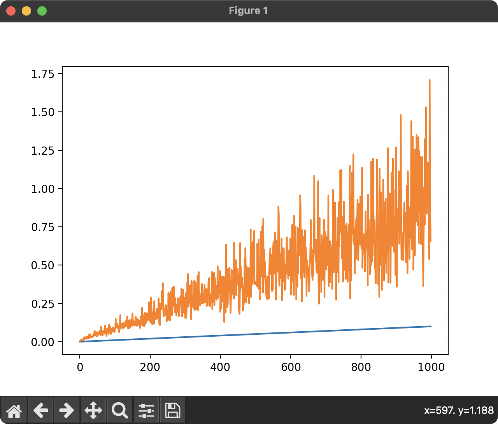
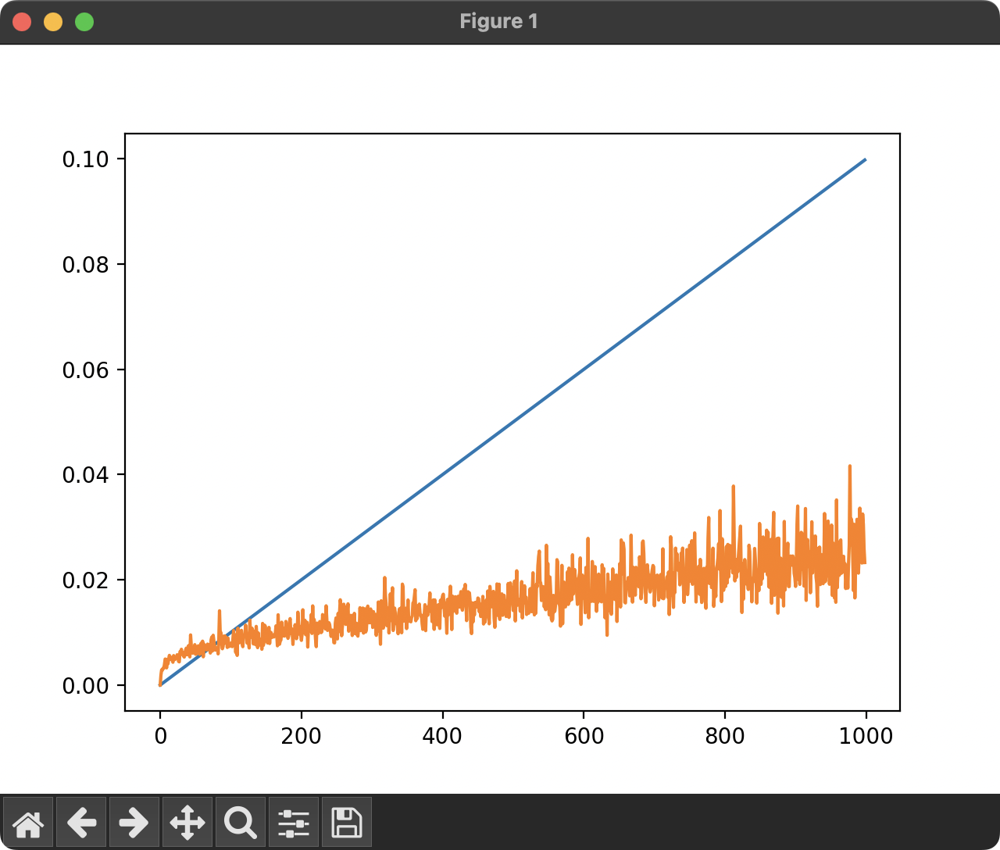

# Written answer to Q4

_Code available in q4.py_

My approach was to increase the initialization variance linearly with the iteration number.

`variance = i / 10000`

My weights were then initialized like this:

```
def initialize_parameters(X, Y, hidden_size, variance):
    input_size = X.shape[0]
    output_size = Y.shape[0]
    std_dev1 = np.sqrt(variance)
    std_dev2 = np.sqrt(variance)
    W1 = np.random.normal(0, std_dev1, (hidden_size, input_size))
    W2 = np.random.normal(0, std_dev2, (output_size, hidden_size))
    return {'W1': W1, 'W2': W2}
```

This resulted in this data (variance of input vs. variance of output):


As the variance increased, the odds of exploding gradients went up because the variance of the output increased and became more unpredictable. We need a variance that scales to the size of the input. This was my approach:

```
def initialize_parameters(X, Y, hidden_size, variance):
    input_size = X.shape[0]
    output_size = Y.shape[0]
    std_dev1 = np.sqrt(variance / input_size)
    std_dev2 = np.sqrt(variance / hidden_size)
    W1 = np.random.normal(0, std_dev1, (hidden_size, input_size))
    W2 = np.random.normal(0, std_dev2, (output_size, hidden_size))
    return {'W1': W1, 'W2': W2}
```

I divided the variance by input_size and hidden_size

This resulted in data that looked like this:


Much more reasonable.
